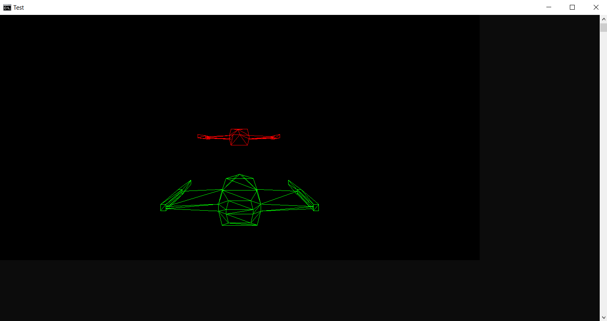

# CroipeEngine
A header only C++ 17 game engine, allowing you to draw 3D Wireframe graphics directly to the command prompt. It also has a primitive audio/input layer, and we plan to add scripting.


[Code](https://github.com/Croipe/CroipeExamples/tree/main/SpaceShipExample) [The spaceship comes from OneLoneCoder's Repository](https://github.com/OneLoneCoder/videos/blob/master/VideoShip.obj)

# Dependencies
Made entirely from standard and Windows libraries.

# A Minimal Example
```cpp
#include "CroipeEngine/Croipe.cpp"

int main() {
  Croipe::RenderPlatform::CreateScreen("Title", { "Generic Loading Message", "Message 2" });
  
  while (true) {
    Croipe::RenderPlatform::ClearScreen();
    Croipe::TimeHandler::ClockStart();
    // Game Logic
    Croipe::RenderPlatform::UpdateScreen();
    Croipe::TimeHandler::ClockEnd();
  }
  
  Croipe::RenderPlatform::Dispose();
  return 0;
}
```
# Todo
- Move examples to seperate repositories 
- Add scripting
- Complete documentation
